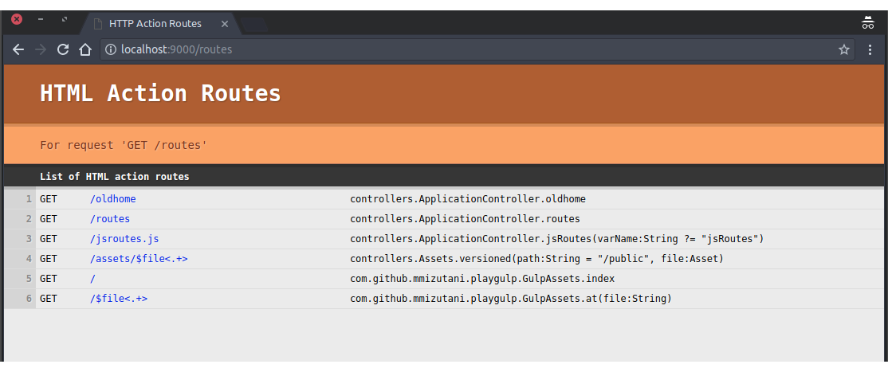
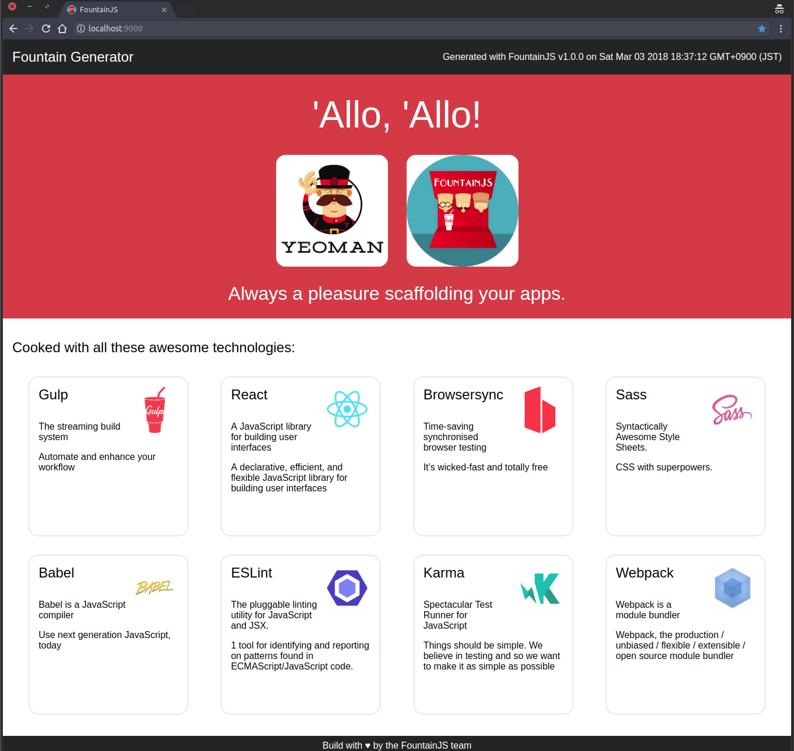

# play-gulp-react

A demo application for the [SBT Play Gulp plugin](http://www.github.com/mmizutani/sbt-play-gulp).
The Gulp frontend project in the `ui` subdirectory is generated by [Yeoman Fountain generators](http://fountainjs.io/) with default configurations (Gulp, React, Babel, Webpack and SCSS). You can also switch the SPA framework from React to Angular and Vue as long as Gulp is selected as the task runner.

To run this sample Play app with sbt-play-gulp plugin, clone this repository, cd into this directory and follow [the instruction](https://github.com/mmizutani/sbt-play-gulp#how-to-use-this-sbt-plugin).

## Online Demo

https://play-gulp-react.herokuapp.com

* The frontend page built with Gulp is served at the root path [`/`](https://play-gulp-react.herokuapp.com/).
* The default Play landing page is available at the path [`/oldhome`](https://play-gulp-react.herokuapp.com/oldhome).
* You can see the list of available routes at [`/routes`](https://play-gulp-react.herokuapp.com/routes).

## Deploy your own to Heroku

Thanks to the powerful [Heroku multi build pack](https://github.com/ddollar/heroku-buildpack-multi), you can deploy this non-standard hybrid application to Heroku in one go.

